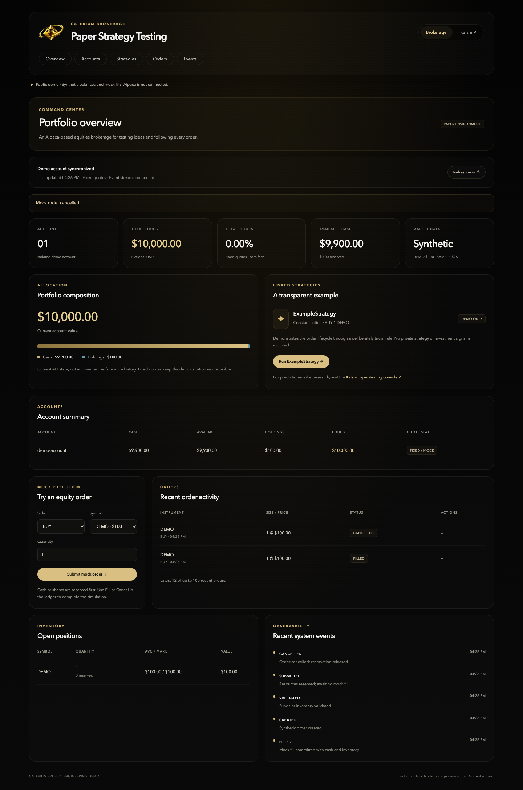
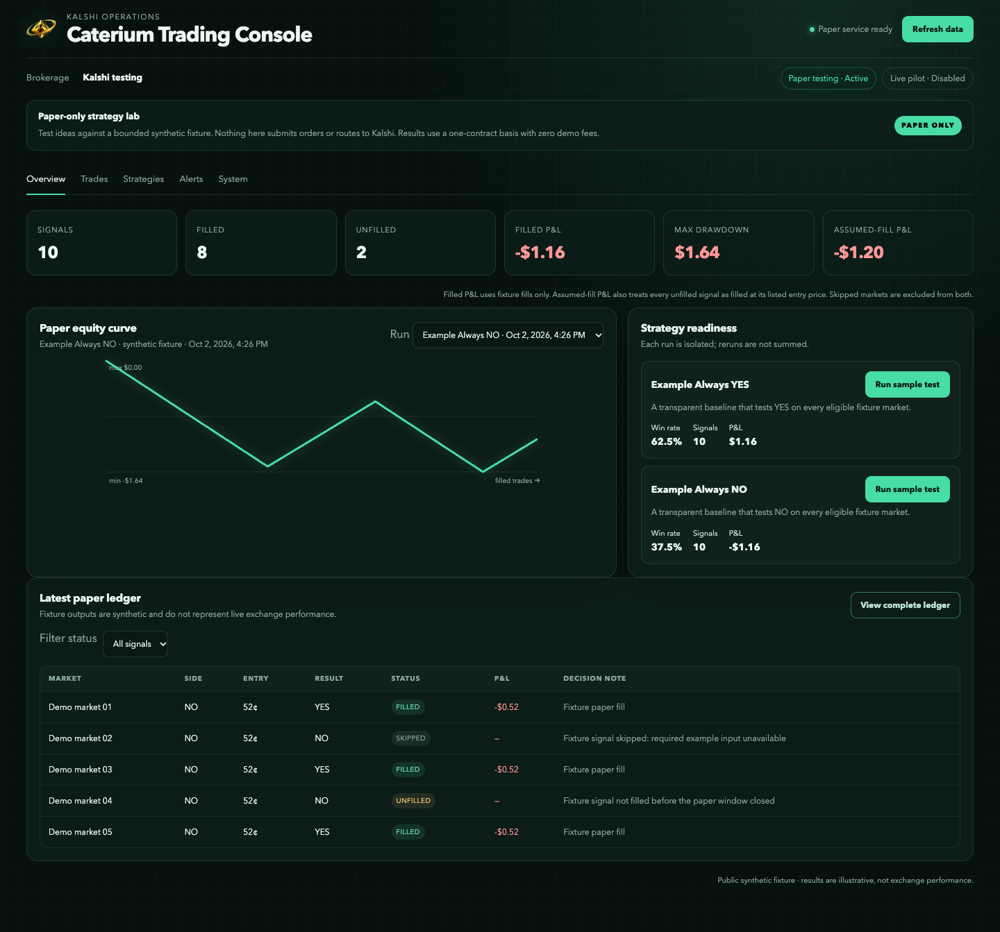
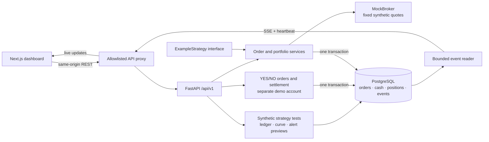

<p align="center">
  
</p>

<h1 align="center">Caterium</h1>

<p align="center">
  An Alpaca-based equities brokerage. A Kalshi strategy-testing workspace.<br />
  Research ideas. Run paper tests. Track performance. Get Gmail alerts.
</p>

<p align="center">
  <a href="#run-it">Run the demo</a> ·
  <a href="#a-three-minute-tour">Take the tour</a> ·
  <a href="docs/ARCHITECTURE.md">Architecture</a> ·
  <a href="docs/TESTING.md">Tests</a> ·
  <a href="https://github.com/crocco7575/caterium-public/actions">CI results</a> ·
  <a href="docs/DESIGN_DECISIONS.md">Design decisions</a>
</p>

---

**Caterium combines an Alpaca-based equities brokerage with a Kalshi strategy research and paper-testing platform.** The brokerage tracks accounts, orders, fills, positions, and portfolio performance. The Kalshi workspace tests strategy ideas, follows paper signals through filled and unfilled outcomes, and monitors results and system health. Gmail alerts surface new paper trades so they can be reviewed without watching the dashboard all day.

**This repository is the public engineering demo—not the full platform.** It recreates the two interfaces with fictional data: mock equity orders on one page, saved sample strategy tests and email previews on the other. It does not connect to Alpaca, Kalshi, or Gmail. Production adapters, research engines, private strategies, credentials, execution logic, and real results stay private.



<sub>Brokerage — recreated from the private interface's layout and visual style, using only synthetic demo state.</sub>

### Two workspaces

| Brokerage · `/brokerage` | Kalshi paper testing · `/kalshi` |
| --- | --- |
| Black-and-gold portfolio overview | Dark-green paper-testing console |
| Mock BUY/SELL, reservations, fills, cancellations | Run two transparent example strategies over 12 invented markets |
| Accounts, positions, orders, and streamed events | Compare results, inspect decisions, review filled/unfilled rows |
| $10,000 fictional starting balance | Saved runs, calculated curves, and Gmail message previews |

The Kalshi page is for **testing and monitoring strategies, not submitting exchange orders**. Its examples always choose YES or always choose NO; authored fill flags and outcomes make the arithmetic inspectable. One contract per signal, zero fees, no market realism. Repeating a test does not create new evidence.



<sub>Kalshi — synthetic paper-test results, not actual strategy performance. No manual order ticket or live execution controls.</sub>

### Gmail alerts

In the private platform, a new paper trade can trigger a Gmail/SMTP email with its strategy, market, side, limit price, requested size, and fill-support details. A stored alert ledger suppresses repeat notifications, and delivery failures are reported. The public **Alerts** tab demonstrates the message workflow with previews only: no Gmail login, credentials, or outbound mail.

## At a glance

| Layer | What you can inspect |
| --- | --- |
| **Interface** | Two Next.js / React / TypeScript pages; API-backed state, accessible controls, streamed equity events |
| **API** | FastAPI, Pydantic request validation, versioned routes, idempotent mutations |
| **Domain** | Equity order lifecycle, deterministic paper-test scoring, filled versus assumed-filled records, alert previews; separate settlement API example |
| **Persistence** | SQLAlchemy 2, PostgreSQL, Alembic migrations, transactional domain events |
| **Verification** | pytest, isolated databases, Ruff, mypy, ESLint, TypeScript, CI jobs |
| **Development** | Docker Compose, locked dependencies, synthetic fixtures, no brokerage account required |

## Run it

With Docker Engine and Docker Compose running, from this directory:

```bash
docker compose up --build
```

Open **[localhost:3000](http://localhost:3000)**. Interactive API documentation is at **[localhost:8000/docs](http://localhost:8000/docs)**.

To obtain the source first:

```bash
git clone https://github.com/crocco7575/caterium-public.git
cd caterium-public
```

Compose starts PostgreSQL, applies the schema migrations, seeds two separate synthetic accounts, and starts the API and dashboard. The `.env.example` values are deliberately fake local defaults; no configuration or real credentials are required. Ports bind to loopback, and the database has no published port.

To stop while keeping your demo data:

```bash
docker compose down
```

Prefer not to run containers? See the [two-terminal setup](docs/DEVELOPMENT.md) using SQLite and Node.js. Compose's resource limits apply at runtime, not during image builds.

## A three-minute tour

1. **Submit** a BUY order for the fictional `DEMO` instrument. Cash is reserved, not spent.
2. **Fill** it through `MockBroker`. The order, cash, position, and events update together.
3. **Cancel** a second submitted order. Its reservation is released without changing holdings.
4. **Try a rejection** by selling inventory you do not own. The reason becomes part of the persisted record.
5. **Run ExampleStrategy**. It proposes one fixed demonstration order through the same validation path.
6. **Watch the event stream** in another tab. Reconnects replay committed events with monotonically increasing IDs.

Then open **Kalshi**:

1. Run **Example Always YES** against the 12-market synthetic fixture.
2. Inspect the record, calculated equity curve, and maximum drawdown.
3. In **Trades**, filter filled, unfilled, and skipped rows. Assumed-filled P&L is separate from fixture-filled P&L.
4. In **Strategies**, inspect why every row filled, remained unfilled, or was skipped.
5. Open **Alerts** to preview the paper-trade emails. Nothing is sent.
6. Run **Example Always NO** and use the run selector to compare. Refreshing preserves completed runs; reruns are not added together.

All results are authored-fixture arithmetic, not a backtest on real markets or evidence of an investment edge. The lower-level YES/NO settlement example remains available through the documented API, not as the Kalshi page's workflow.

## Architecture



The backend owns accounting and sample-test scoring. The frontend does not invent fills or authoritative balances. Equities events stream through SSE; the Kalshi page reads saved runs after actions or an explicit refresh. There is no hidden research worker or background trading process.

### Engineering highlights

- **Retry-safe creation.** An idempotency key identifies a request. Identical retries reuse the order; a different payload under that key is rejected.
- **Funds are reserved before execution.** Submitting multiple orders cannot spend the same available balance. Sell submissions reserve inventory rather than permitting accidental shorting.
- **Atomic portfolio changes.** Fills update the order, cash, holdings, and events within one database transaction.
- **Explicit terminal states.** Fill and cancel operations have defined retry behavior. Invalid transitions do not silently mutate holdings.
- **Settlement without double payment.** Resolving a fictional market cancels its open orders, releases cash, records the result, and credits winning holdings in one transaction. Repeated outcomes cannot pay twice; conflicting outcomes fail.
- **Replaceable boundaries, one honest implementation.** Strategy and broker interfaces are present; only an intentionally trivial example and a mock provider ship.
- **Observable by construction.** Durable events drive the activity log and resumable SSE feed; heartbeat messages distinguish a quiet stream from a disconnected one.

Read [the architecture](docs/ARCHITECTURE.md) for transaction boundaries and [the decisions](docs/DESIGN_DECISIONS.md) for the compromises—including what SQLite tests do **not** prove about PostgreSQL concurrency.

## Testing is part of the design

**[Backend test suite](backend/tests/) · [Frontend test suite](frontend/tests/) · [GitHub Actions results](https://github.com/crocco7575/caterium-public/actions)**

Backend tests exercise the HTTP boundary, service behavior, persistence, and failure paths against isolated synthetic data. Frontend checks validate lint, types, and the production build. CI also uses an isolated PostgreSQL service.

See the [dated verification record](docs/VERIFICATION.md) for measured test results, browser checks, and limitations. PostgreSQL locking checks are separate from the fast SQLite suite.

```bash
cd backend
uv sync --frozen
uv run pytest -q
uv run pytest --cov=app --cov-report=term-missing
uv run ruff check .
uv run ruff format --check .
uv run mypy app
```

```bash
cd frontend
npm ci
npm run lint
npm run typecheck
npm test
npm run build
```

Run the project-owned publication checks from the repository root:

```bash
python3 tools/publication_check.py
docker compose config --quiet
```

[Testing guide →](docs/TESTING.md) · [Local verification record →](docs/VERIFICATION.md)

GitHub Actions is configured in [`.github/workflows/ci.yml`](.github/workflows/ci.yml). Check the [actual workflow results](https://github.com/crocco7575/caterium-public/actions) for the current commit; configuration alone does not establish that checks passed. There is no automatic deployment job.

## Repository map

```text
backend/
  app/              # API, typed schemas, domain services, persistence
  migrations/       # Fresh public-demo schema history
  tests/            # Isolated unit and integration checks
frontend/
  app/              # Dashboard and bounded same-origin API proxy
  components/       # Presentation and interaction
docs/               # Architecture, decisions, testing, publication notes
examples/
  synthetic_data/   # Explanation of the fictional fixture universe
tools/              # Public-source hygiene checks
.github/workflows/  # Backend, frontend, and publication CI
```

## What's intentionally missing

This is an engineering showcase, **not a research release or trading product**. It excludes:

- Proprietary strategies, signals, models, features, parameters, and allocation logic.
- Private execution behavior, live broker adapters, and exchange connectivity.
- Research notebooks, datasets, backtests, trade logs, and real performance figures.
- Credentials, personal or investor records, real accounts, and production infrastructure.
- The private repository's Git history.

The demo deliberately omits authentication, authorization, market realism, and production operations. **Do not expose it to the public internet or use it with real funds.** See [publication and security boundaries](docs/PUBLICATION.md).

## Disclaimer

This repository is an educational software-engineering demonstration. Synthetic examples are not financial advice, investment recommendations, or representations of actual trading performance. The demo does not connect to a brokerage or execute real trades.

No open-source license has been selected yet; public visibility alone would not grant reuse rights. Choose an appropriate license before publishing if you intend to permit reuse.
