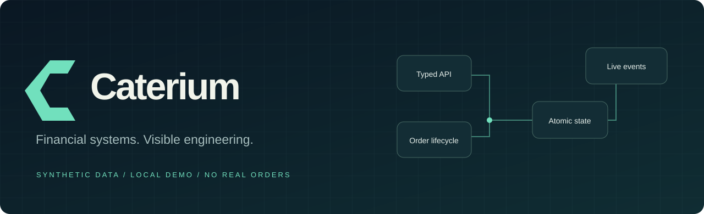
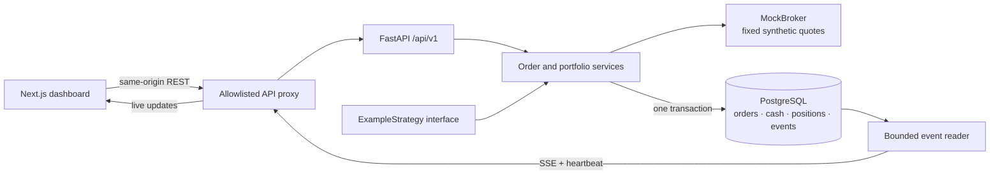

<p align="center">
  
</p>

<p align="center">
  <strong>Follow an order from API request to portfolio update.</strong><br />
  Typed boundaries. Transactional state. A live view of what happened.
</p>

<p align="center">
  <a href="#run-it">Run the demo</a> ·
  <a href="#a-three-minute-tour">Take the tour</a> ·
  <a href="docs/ARCHITECTURE.md">Architecture</a> ·
  <a href="docs/TESTING.md">Tests</a> ·
  <a href="docs/DESIGN_DECISIONS.md">Design decisions</a>
</p>

---

Caterium is a financial technology platform for researching, testing, monitoring, and operating systematic investment strategies.

The broader platform spans **equities and prediction-market workflows, including Kalshi**. This public slice demonstrates their shared systems-engineering concerns with an equities-style mock order lifecycle. It does **not** implement an exchange adapter, binary-contract settlement, or a live trading system.

**This repository is a sanitized engineering demonstration of portions of Caterium's platform architecture.** Proprietary research, production strategies, execution logic, credentials, datasets, and internal infrastructure have intentionally been excluded. The public implementation is newly authored around generic architectural patterns; it is not a production source-code export.

Every balance, instrument, order, and fill here is **synthetic**. `MockBroker` cannot submit a real order. `ExampleStrategy` is a constant demonstration action, not an investment strategy.


<sub>Captured from the running local demo after a mock fill and cancellation. All visible data is synthetic.</sub>

## At a glance

| Layer | What you can inspect |
| --- | --- |
| **Interface** | Next.js / React / TypeScript dashboard; real API state, accessible forms, streamed events |
| **API** | FastAPI, Pydantic request validation, versioned routes, idempotent mutations |
| **Domain** | Explicit order lifecycle, cash and inventory reservations, mock fills and portfolio updates |
| **Persistence** | SQLAlchemy 2, PostgreSQL, Alembic migrations, transactional domain events |
| **Verification** | pytest, isolated databases, Ruff, mypy, ESLint, TypeScript, CI jobs |
| **Development** | Docker Compose, locked dependencies, synthetic fixtures, no brokerage account required |

## Run it

With Docker Engine and Docker Compose running, from this directory:

```bash
docker compose up --build
```

Open **[localhost:3000](http://localhost:3000)**. Interactive API documentation is at **[localhost:8000/docs](http://localhost:8000/docs)**.

To obtain the source first:

```bash
git clone https://github.com/crocco7575/caterium-public.git
cd caterium-public
```

Compose starts PostgreSQL, applies the schema migration, seeds one synthetic account, and starts the API and dashboard. The `.env.example` values are deliberately fake local defaults; no configuration or real credentials are required. Ports bind to loopback, and the database has no published port.

To stop while keeping your demo data:

```bash
docker compose down
```

Prefer not to run containers? See the [two-terminal setup](docs/DEVELOPMENT.md) using SQLite and Node.js. Compose's resource limits apply at runtime, not during image builds.

## A three-minute tour

1. **Submit** a BUY order for the fictional `DEMO` instrument. Cash is reserved, not spent.
2. **Fill** it through `MockBroker`. The order, cash, position, and events update together.
3. **Cancel** a second submitted order. Its reservation is released without changing holdings.
4. **Try a rejection** by selling inventory you do not own. The reason becomes part of the persisted record.
5. **Run ExampleStrategy**. It proposes one fixed demonstration order through the same validation path.
6. **Watch the event stream** in another tab. Reconnects replay committed events with monotonically increasing IDs.

There are no invented trading returns or simulated profitability charts. The dashboard shows operational state, not evidence of an investment edge.

## Architecture



The backend owns the state machine. The frontend does not infer fills or recalculate authoritative balances. Domain events are persisted alongside mutations; SSE is a transport for those committed records, not a second source of truth.

### Engineering highlights

- **Retry-safe creation.** An idempotency key identifies a request. Identical retries reuse the order; a different payload under that key is rejected.
- **Funds are reserved before execution.** Submitting multiple orders cannot spend the same available balance. Sell submissions reserve inventory rather than permitting accidental shorting.
- **Atomic portfolio changes.** Fills update the order, cash, holdings, and events within one database transaction.
- **Explicit terminal states.** Fill and cancel operations have defined retry behavior. Invalid transitions do not silently mutate holdings.
- **Replaceable boundaries, one honest implementation.** Strategy and broker interfaces are present; only an intentionally trivial example and a mock provider ship.
- **Observable by construction.** Durable events drive the activity log and resumable SSE feed; heartbeat messages distinguish a quiet stream from a disconnected one.

Read [the architecture](docs/ARCHITECTURE.md) for transaction boundaries and [the decisions](docs/DESIGN_DECISIONS.md) for the compromises—including what SQLite tests do **not** prove about PostgreSQL concurrency.

## Testing is part of the design

Backend tests exercise the HTTP boundary, service behavior, persistence, and failure paths against isolated synthetic data. Frontend checks validate lint, types, and the production build. CI also uses an isolated PostgreSQL service.

**Local verification:** 18 backend tests passed with 95% statement coverage; 8 frontend proxy tests passed. Three PostgreSQL-only concurrency tests were skipped locally. See the [dated verification record](docs/VERIFICATION.md) for commands, scope, and limitations.

```bash
cd backend
uv sync --frozen
uv run pytest -q
uv run pytest --cov=app --cov-report=term-missing
uv run ruff check .
uv run ruff format --check .
uv run mypy app
```

```bash
cd frontend
npm ci
npm run lint
npm run typecheck
npm test
npm run build
```

Run the project-owned publication checks from the repository root:

```bash
python3 tools/publication_check.py
docker compose config --quiet
```

[Testing guide →](docs/TESTING.md) · [Local verification record →](docs/VERIFICATION.md)

GitHub Actions is configured in [`.github/workflows/ci.yml`](.github/workflows/ci.yml). Check the [actual workflow results](https://github.com/crocco7575/caterium-public/actions) for the current commit; configuration alone does not establish that checks passed. There is no automatic deployment job.

## Repository map

```text
backend/
  app/              # API, typed schemas, domain services, persistence
  migrations/       # Fresh public-demo schema history
  tests/            # Isolated unit and integration checks
frontend/
  app/              # Dashboard and bounded same-origin API proxy
  components/       # Presentation and interaction
docs/               # Architecture, decisions, testing, publication notes
examples/
  synthetic_data/   # Explanation of the fictional fixture universe
tools/              # Public-source hygiene checks
.github/workflows/  # Backend, frontend, and publication CI
```

## What's intentionally missing

This is an engineering showcase, **not a research release or trading product**. It excludes:

- Proprietary strategies, signals, models, features, parameters, and allocation logic.
- Private execution behavior, live broker adapters, and exchange connectivity.
- Research notebooks, datasets, backtests, trade logs, and real performance figures.
- Credentials, personal or investor records, real accounts, and production infrastructure.
- The private repository's Git history.

The demo deliberately omits authentication, authorization, market realism, and production operations. **Do not expose it to the public internet or use it with real funds.** See [publication and security boundaries](docs/PUBLICATION.md).

## Disclaimer

This repository is an educational software-engineering demonstration. Synthetic examples are not financial advice, investment recommendations, or representations of actual trading performance. The demo does not connect to a brokerage or execute real trades.

No open-source license has been selected yet; public visibility alone would not grant reuse rights. Choose an appropriate license before publishing if you intend to permit reuse.
