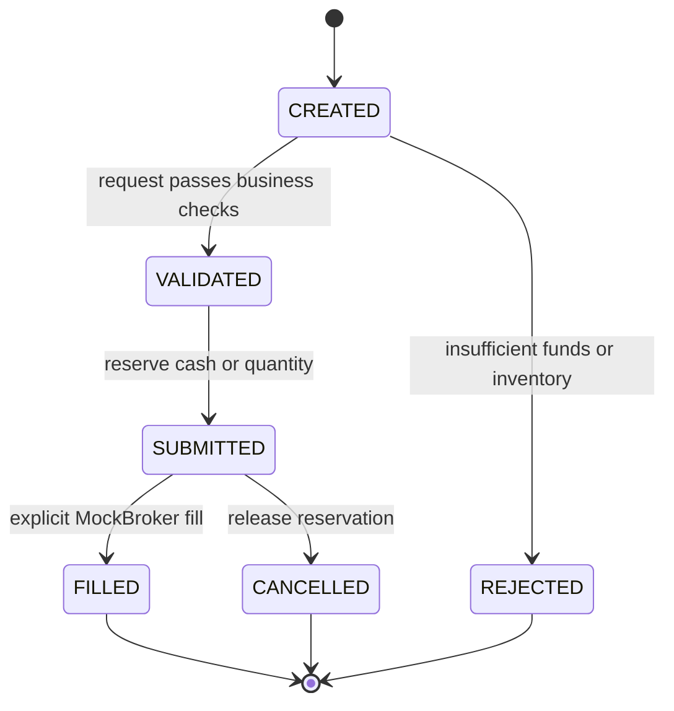

# Architecture: one transaction, one source of truth

## Scope

This newly authored public demo illustrates generic patterns from Caterium's equities brokerage layer built on Alpaca and its prediction-market tools for Kalshi. It is not a release of either integration. Two fictional equities, two fictional YES/NO markets, and two separate synthetic accounts keep the example inspectable; no private source, datasets, strategies, or execution behavior are required.

## Components

| Component | Responsibility | Does not own |
| --- | --- | --- |
| Next.js dashboard | Render authoritative API state; collect demo actions | Balances, fills, authorization |
| Same-origin proxy | Forward allowlisted API routes; carry SSE | Arbitrary upstream URLs |
| FastAPI routes | Validate inputs and map service errors to HTTP | Strategy decisions or browser state |
| Order service | Enforce transitions, reserve resources, commit accounting | Real exchange connectivity |
| Prediction service | Buy YES/NO contracts, reserve cash, settle fictional outcomes once | Real markets, exchange rules, research or fees |
| Paper fixture service | Score two constant-side examples; persist run, ledger, curve, and email previews | Account mutations, real strategy research, email delivery |
| Strategy interface | Produce a request compatible with the service | Private models or signals |
| MockBroker | Fixed fictional prices for explicit full fills | Market microstructure or realistic execution |
| PostgreSQL | Orders, account, inventory, durable event log | In-memory UI projections |

See [API_CONTRACT.md](API_CONTRACT.md) for the wire format.

## Order lifecycle

Malformed requests stop at the API boundary with HTTP 422. Business-rule rejections persist an order and rejection event. Intermediate states are recorded as events; the order row stores its current state. A request key binds an order to its original payload; identical retries return it, and key reuse with a different payload returns HTTP 409.

## Transaction boundary

A submission serializes access to the synthetic account on PostgreSQL, validates available funds or unreserved inventory, stores the order, and persists lifecycle events together. A fill moves cash and quantity and releases the reservation in the same transaction. A cancellation releases only the reservation. Terminal operations have explicit retry and conflict behavior.

For BUY orders, available cash is `cash − reserved_cash`. For SELL orders, available inventory is `quantity − reserved_quantity`. The demo permits neither borrowing nor shorting. Decimal arithmetic and fixed-point columns represent money; floats are not the accounting model.

Serializing mutations on their demo account is intentionally conservative. Equity and prediction balances are separate; this is not a shared-margin portfolio. It makes correctness visible but is not a high-throughput execution design. SQLite is a local convenience and test option; it does not provide PostgreSQL row-lock semantics.

## Two interfaces, different workflows

`/brokerage` recreates the private brokerage's black-and-gold overview with mock orders, holdings, and account state. `/kalshi` recreates the dark-green paper console with strategy tests, decisions, ledgers, and alert previews. `/` redirects to `/brokerage`. Layout and styling were observed read-only; component implementations and fixture data are newly authored. Only the approved Caterium logo is reused.

The paper-testing service scores 12 authored markets using constant YES/NO examples and predetermined fill/skip flags. It persists an immutable completed run with integer-cent calculations in its own table. It never calls either order service or moves account cash. The latest 20 runs are returned; the UI selects one run instead of adding reruns into a cumulative performance claim. An idempotency key prevents ambiguous-response retries from creating duplicate runs.

The private platform's Gmail/SMTP notifier sends paper-trade details and records sent IDs to suppress duplicates. The public service stores **preview-only** message text alongside each run. No mail transport, credentials, recipients, or delivery process is included.

## Prediction-market settlement (API-only example)

The prediction workspace has a separate $1,000 synthetic account and its own market, order, fill, position, and event records. Only purchases are supported. Quotes are authored constants; the browser cannot supply a fill price.

An OPEN market accepts YES or NO purchases. Submission reserves cash, an explicit full fill deducts the cost and adds contracts, and cancellation releases the reservation. The user then chooses a fictional result. In one transaction, settlement cancels all pending orders for that market, releases their cash, pays $1 per winning contract and zero per losing contract, records the outcome, and emits durable events.

Market settlement is final. Repeating the same result returns the existing result without paying again; a different result is a conflict. Filled holdings retain their quantity, cost basis, and payout for inspection, but settled contracts have zero remaining market value. Equity is cash plus the fixed-quote value of open holdings, so payouts are not counted twice. Realized demo P&L is settled payout minus settled cost basis.

The account lock serializes submission, filling, cancellation, and settlement. A concurrent fill either completes before settlement and is paid accordingly, or loses the race and cannot fill a cancelled/closed order. This accounting example is not an implementation of Kalshi's matching engine, fees, lifecycle timing, or exchange API.

## Events and reconnects

Events commit with the state they describe. The SSE endpoint reads small, ordered batches using a cursor and releases each database session before waiting. Domain messages carry persisted numeric IDs; heartbeat messages do not. Clients can reconnect with `Last-Event-ID`, deduplicate repeated IDs, and refresh a dashboard snapshot.

This is an at-least-once presentation channel, not an exactly-once message bus. The demo has no independent outbox publisher, external event broker, durable subscriber offsets, event-retention policy, or multi-account ordering guarantee. In particular, this design should not be extrapolated to concurrent multi-account production streams without addressing commit-order versus sequence-order behavior.

The SSE channel belongs to the equities demo. Prediction events are a separate persisted API log. The Kalshi testing page refreshes saved runs after a test or a manual refresh; it does not claim a shared event sequence, background runner, or real-time exchange feed.

## Deployment and trust boundary

Compose contains three local services: frontend, backend, and PostgreSQL. Browser calls stay on the frontend origin; the proxy reaches the backend using a server-only URL. The API and dashboard bind to loopback on the host; PostgreSQL is reachable only on the Compose network.

The backend intentionally has no authentication or tenant isolation because this is a single-user synthetic demo. Loopback binding is not a substitute for production security. Adding an external broker, remote users, account authorization, TLS, quotas, operational telemetry, reconciliation, backup/restore, and deployment controls would require a separate design and review.

## Fresh persistence history

Alembic contains a new public-only schema history. The prediction-market migration adds tables without replacing the equity ledger. The private migration chain and private Git history are not included. Bootstrap creates the fictional accounts and markets idempotently; restarts do not reset balances or reopen settled markets. There is no data import or external synchronization job.
