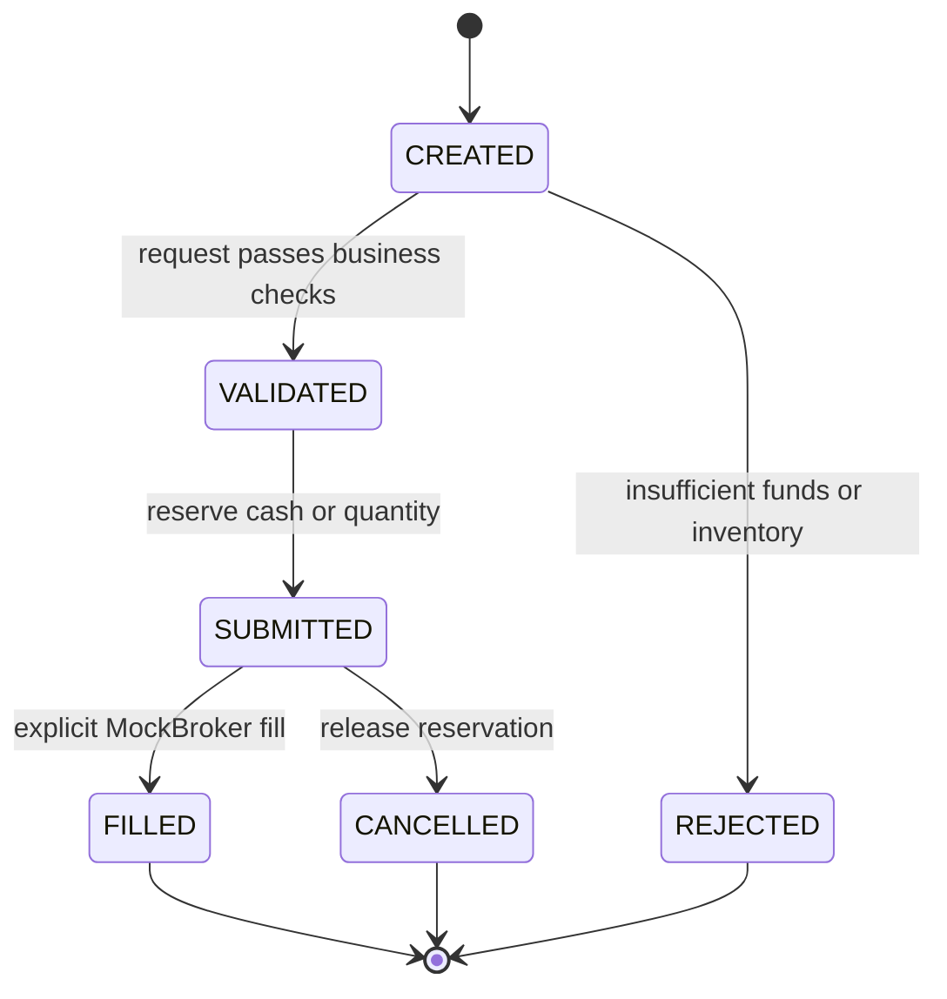

# Architecture: one transaction, one source of truth

## Scope

This newly authored public demo illustrates generic patterns from a broader equities and prediction-market platform. It is not a release of either production system. Two fictional instruments and a single synthetic account keep the example inspectable; no private source, datasets, strategies, or execution behavior are required.

## Components

| Component | Responsibility | Does not own |
| --- | --- | --- |
| Next.js dashboard | Render authoritative API state; collect demo actions | Balances, fills, authorization |
| Same-origin proxy | Forward allowlisted API routes; carry SSE | Arbitrary upstream URLs |
| FastAPI routes | Validate inputs and map service errors to HTTP | Strategy decisions or browser state |
| Order service | Enforce transitions, reserve resources, commit accounting | Real exchange connectivity |
| Strategy interface | Produce a request compatible with the service | Private models or signals |
| MockBroker | Fixed fictional prices for explicit full fills | Market microstructure or realistic execution |
| PostgreSQL | Orders, account, inventory, durable event log | In-memory UI projections |

See [API_CONTRACT.md](API_CONTRACT.md) for the wire format.

## Order lifecycle

Malformed requests stop at the API boundary with HTTP 422. Business-rule rejections persist an order and rejection event. Intermediate states are recorded as events; the order row stores its current state. A request key binds an order to its original payload; identical retries return it, and key reuse with a different payload returns HTTP 409.

## Transaction boundary

A submission serializes access to the synthetic account on PostgreSQL, validates available funds or unreserved inventory, stores the order, and persists lifecycle events together. A fill moves cash and quantity and releases the reservation in the same transaction. A cancellation releases only the reservation. Terminal operations have explicit retry and conflict behavior.

For BUY orders, available cash is `cash − reserved_cash`. For SELL orders, available inventory is `quantity − reserved_quantity`. The demo permits neither borrowing nor shorting. Decimal arithmetic and fixed-point columns represent money; floats are not the accounting model.

Serializing on a single account is intentionally conservative. It makes correctness visible but is not a high-throughput execution design. SQLite is a local convenience and test option; it does not provide PostgreSQL row-lock semantics.

## Events and reconnects

Events commit with the state they describe. The SSE endpoint reads small, ordered batches using a cursor and releases each database session before waiting. Domain messages carry persisted numeric IDs; heartbeat messages do not. Clients can reconnect with `Last-Event-ID`, deduplicate repeated IDs, and refresh a dashboard snapshot.

This is an at-least-once presentation channel, not an exactly-once message bus. The demo has no independent outbox publisher, external event broker, durable subscriber offsets, event-retention policy, or multi-account ordering guarantee. In particular, this design should not be extrapolated to concurrent multi-account production streams without addressing commit-order versus sequence-order behavior.

## Deployment and trust boundary

Compose contains three local services: frontend, backend, and PostgreSQL. Browser calls stay on the frontend origin; the proxy reaches the backend using a server-only URL. The API and dashboard bind to loopback on the host; PostgreSQL is reachable only on the Compose network.

The backend intentionally has no authentication or tenant isolation because this is a single-user synthetic demo. Loopback binding is not a substitute for production security. Adding an external broker, remote users, account authorization, TLS, quotas, operational telemetry, reconciliation, backup/restore, and deployment controls would require a separate design and review.

## Fresh persistence history

Alembic contains a new public-only schema history. The private migration chain and private Git history are not included. Startup initializes only the fictional demo account; there is no data import or external synchronization job.
